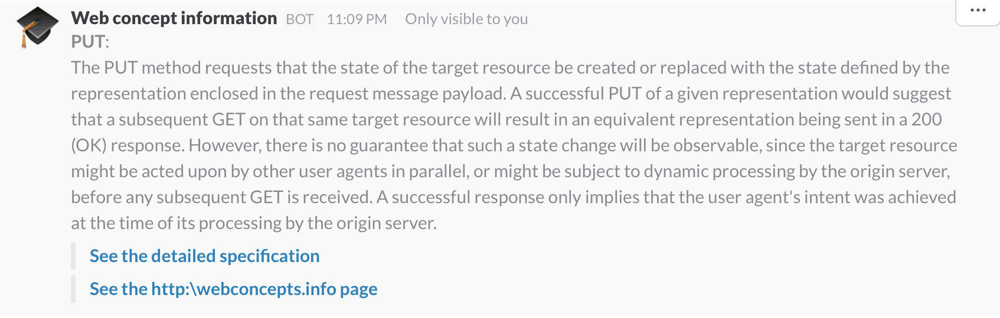

# slack-web-concept

A [Webtask](https://webtask.io) to create a Slack "slash command" that searches and presents information about [Web Concepts](http://webconcepts.info).



## usage

* Go the [https://webtask.io](https://webtask.io) and create an account.

* Install the webtask CLI tool on your system.

```
npm install wt-cli -g
```

* Login into your account (a code will be sent to the provided email).

```
wt init your-email@example.com
```

* Create the webtask and copy the URL where it is deployed (it will appear in the console output).

```
wt create --name slack-web-concept index.js
```

* Go to your slack and create a [slash command](https://{teamname}.slack.com/apps/search?q=slash)
  * Give it a name (e.g. `/web-concept`).
  * Fill the URL with the webtask URL copied in the previous step.
  * Copy the token.

* Create the webtask again, now defining the token as a secret.

```
wt create --name slack-web-concept index.js --secret slack-token=the-token-copied-from-slack
```

* And that it's. You can now try the slash command from Slack.
